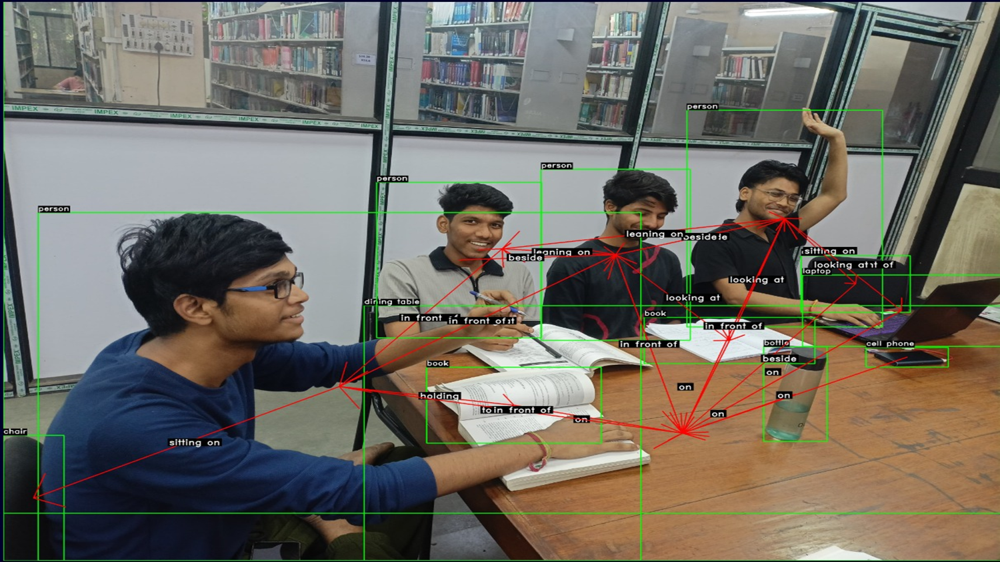
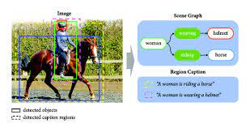
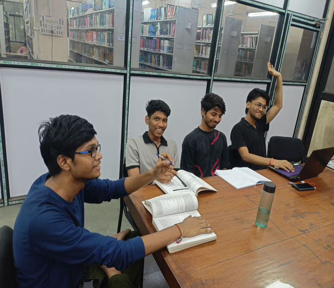
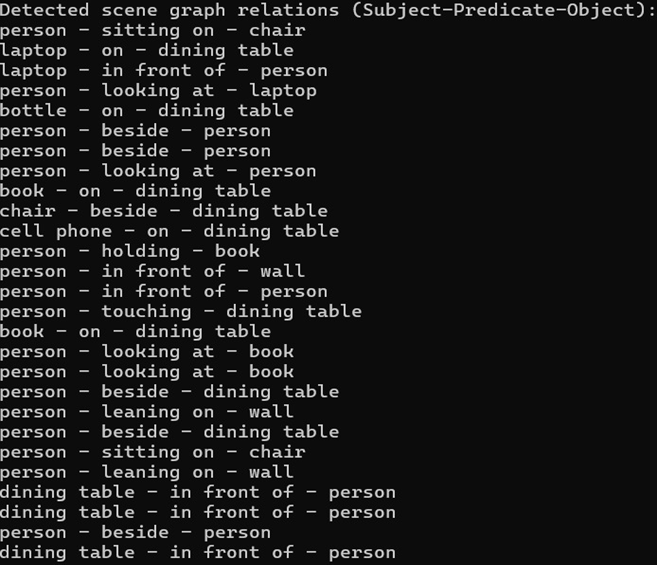
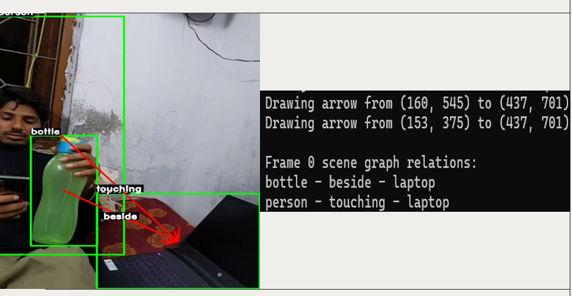
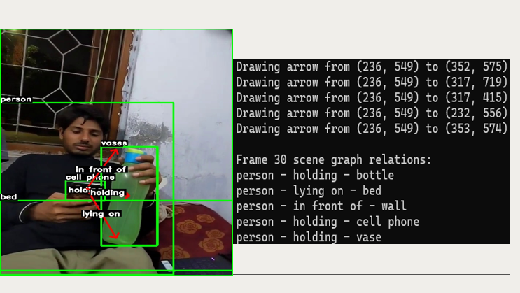
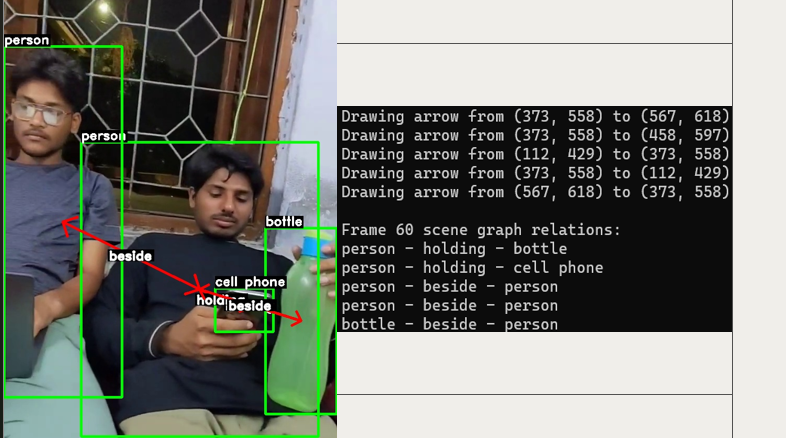
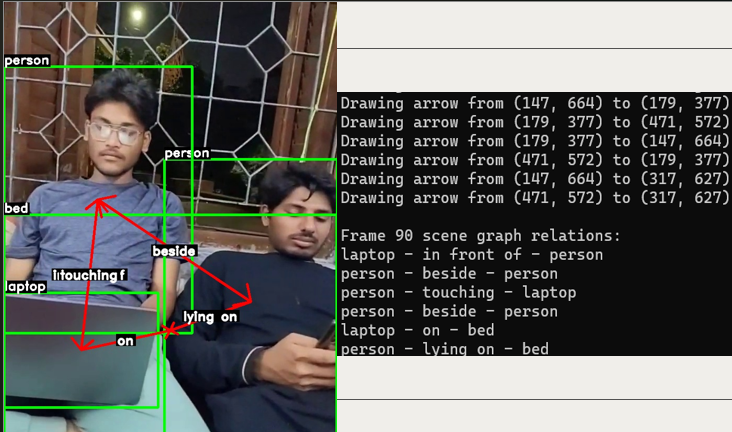
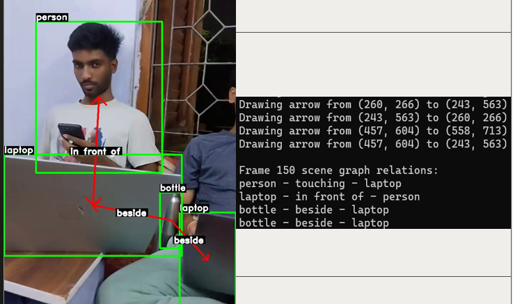
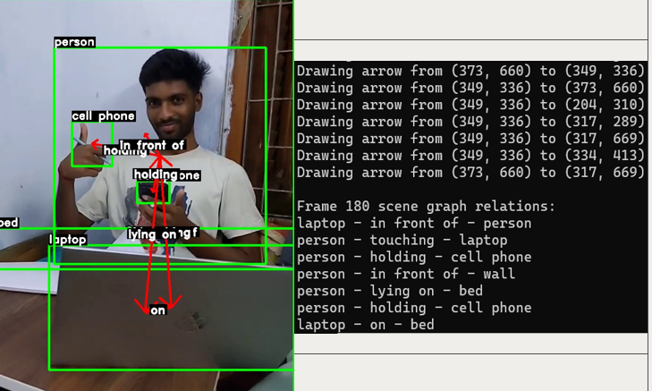

# 🧠 Scene Graph Generation from Images & Videos

This project explores **Scene Graph Generation** for better understanding of both static images and dynamic videos. We extract object-level interactions to produce meaningful triplets like:

> `person - holding - bottle`  
> `laptop - on - bed`

By combining **YOLO** for object detection and a custom **relation classifier**, we build a structured representation of visual scenes.

---

## 📸 What is a Scene Graph?

A **scene graph** is a graphical representation of a visual scene where:
- **Nodes** = Objects (e.g., person, bottle, laptop)
- **Edges** = Relationships (e.g., beside, holding, touching)

  
   <em>Illustration of a Scene Graph (Source: Wikipedia)</em>

# 🧠 Scene Graph Generation from Images & Videos

This project explores **Scene Graph Generation** for better understanding of both static images and dynamic videos. We extract object-level interactions to produce meaningful triplets like:

> `person - holding - bottle`  
> `laptop - on - bed`

By combining **YOLO** for object detection and a custom **relation classifier**, we build a structured representation of visual scenes.

---

## 📸 What is a Scene Graph?

A **scene graph** is a graphical representation of a visual scene where:
- **Nodes** = Objects (e.g., person, bottle, laptop)
- **Edges** = Relationships (e.g., beside, holding, touching)

  
   <em>Illustration of a Scene Graph (Source: Wikipedia)</em>

---

## 🔍 Case Study: Dining Table Scene

### Input Image

  
   <em>A collaborative workspace scene with multiple people around a dining table</em>

### Detection Output

  
   <em>YOLO detection with bounding boxes identifying objects and their spatial relationships</em>

### Transcript for the Output

  

### Extracted Scene Graph
---

## 🎥 Demo Snapshots

| Frame | Scene Graph |
|-------|-------------|
|  | `bottle - beside - laptop` `person - touching - laptop` |
|  | `person - holding - bottle` `person - lying on - bed` `person - holding - vase` |
|  | `person - holding - bottle` `person - beside - person` `bottle - beside - person` |
|  | `laptop - in front of - person` `person - beside - person` `person - touching - laptop` |
|  | `person - touching - laptop` `bottle - beside - laptop` `laptop - in front of - person` |
|  | `person - holding - phone` `laptop - on - bed` `person - in front of - wall` |

> 🔄 See [Media1.mp4](./Media1.mp4) for the full video-based scene graph generation.

---

## 🏗️ Architecture

### 1. **Object Detection**
- **YOLOv5 / YOLOv8**
- Pre-trained on COCO
- Fast and real-time inference

### 2. **Relation Prediction**
- ROI Align features for object pairs
- Relative spatial encoding
- Word embeddings (GloVe)
- MLP-based relation classifier

---
# 🏗️ Scene Graph Generation from Images & Videos

## 🔧 Core Approach: Hierarchical Scene Graph Generation

Our pipeline combines efficient object detection (**YOLO**) with **relation-aware feature fusion** to generate structured scene graphs optimized for **real-time inference**.

---

## 📌 1. Object Detection & Feature Extraction

### 🔹 Backbone: CSPNet (YOLOv5)
- C1–C5 layers extract features at multiple scales  
- CSPNet boosts efficiency by preserving gradients and reducing computation

### 🔹 Neck: PAN-FPN
- Combines low-level + high-level features across scales (P3–P5)

### 🔹 Detection Head
- Predicts bounding boxes, objectness scores, and class labels  
- Applies **Non-Maximum Suppression (NMS)** to filter redundant boxes

---

## 🧠 2. Spatial & Visual Feature Encoding

### 🟩 ROI Align
- Extracts fixed-size object-aligned visual features with bilinear interpolation

### 🟦 Spatial Features
- Encodes geometry (center x, y, width, height) into an **8D vector**

---

## 🔁 3. Relation Prediction

### 🔸 Feature Fusion
- Combines:
  - Visual Features (ROI Align)
  - Spatial Features
  - Semantic Embeddings (GloVe)
- Example:  
  `f = [GloVe("person"); GloVe("horse"); spatial_encoding]`

### 🔸 MLP Classifier + Softmax
- Predicts relation from fused features  
  _e.g., "riding", "next to", "touching"_

### 🔸 Semantic Prior Filtering
- Filters implausible object pairs using **cosine similarity** on GloVe vectors

---

## 📦 Dataset: Panoptic Scene Graph (PSG)

- 49,000+ images with instance + panoptic segmentation  
- **133 object classes**, **56 relationship types**  
- Ground truth triplets of the form: `<Subject, Predicate, Object>`

---

## 📊 Performance & Evaluation

We evaluate using:

- **Recall@50**, **Recall@100**
- **mean Recall (mR@K)** — important for rare relations

| Model   | mR@50 | mR@100 | FPS | Backbone      |
|---------|-------|--------|-----|----------------|
| Motifs  | 6.6   | 7.9    | ~5  | Faster R-CNN   |
| VCTree  | 5.8   | 6.6    | ~4  | Faster R-CNN   |
| PE-NET  | 16.7  | 18.8   | ~3  | Faster R-CNN   |
| **Ours**| 12.4  | 14.5   | ~30 | YOLO (v5/v8)    |

> ⚡ While mR@K is slightly lower, our method is **6–10× faster**, making it ideal for **real-time video scene graph generation (SGG)**.

---

## 🌐 Applications

- 🎥 **Video Surveillance** — Understand interactions like _"person picks up bag"_
- 🤖 **Human-Robot Interaction** — Ground language in visual context
- 🕶️ **AR Anchors & Smart Glasses** — Detect _“person near laptop”_ in real-time
- 📹 **Video Captioning / Summarization**

---

## 🔮 Future Work

- ✅ **Action Recognition**: e.g., _"Person is drinking from bottle"_
- ✅ **Temporal Graphs**: Link object interactions across video frames
- 🚧 **Open-World SGG**: Integrate **CLIP / Vision-Language Models (VLMs)** to generalize beyond dataset constraints

---

## 👨‍💻 Contributors

- **Randhi Nagasurya** (2021ITB015)  
- **Somireddy Naveen Kumar Reddy** (2021ITB085)  
- **Moru Sai Tirupathi** (2021ITB086)

Under the guidance of  
**Dr. Arindam Biswas**  
Department of Information Technology  
**IIEST Shibpur**

---

